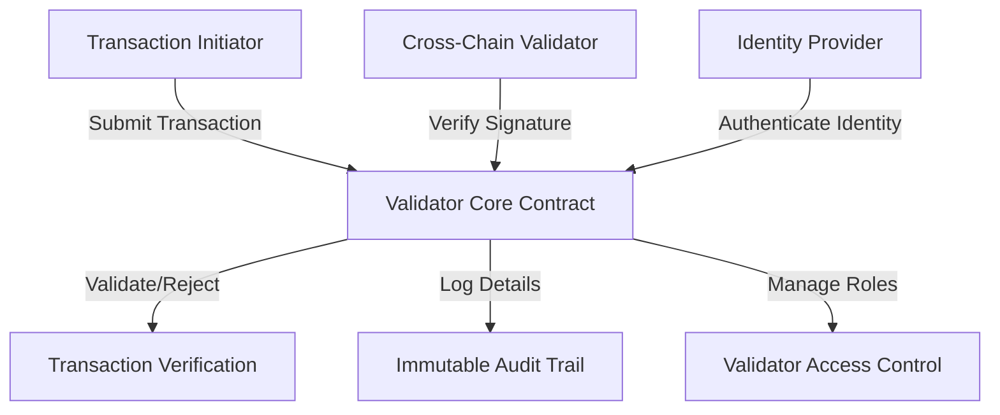

# Polygon Validate

A robust transaction validation and identity verification system built on the Polygon blockchain, ensuring secure and authenticated cross-chain interactions.

## Overview

Polygon Validate is a comprehensive transaction validation and cross-chain identity verification system designed to enhance security and trust in blockchain interactions. The platform provides:

- Robust transaction signature verification
- Multi-role validator management
- Cross-chain identity authentication
- Secure access control mechanisms
- Immutable transaction audit trails
- Flexible validator configuration

## Architecture

The Polygon Validate system is built around a core smart contract that manages validator roles, transaction authentication, and cross-chain verification processes.



### Key Components
- **Validators**: Authenticate and validate cross-chain transactions
- **Identity Providers**: Manage and verify blockchain identities
- **Transaction Verification**: Multi-step signature and permission checks
- **Audit Logs**: Comprehensive, tamper-proof transaction records
- **Role Management**: Granular access control for different validator types

## Contract Documentation

### LoopPulse Core Contract

The main contract (`looppulse-core.clar`) manages all platform functionality:

#### Data Structures
- `users`: User profiles and emergency contact settings
- `healthcare-providers`: Registered and verified healthcare providers
- `health-data`: Encrypted health records
- `data-permissions`: Access control permissions
- `access-logs`: Audit trail of data access

#### Key Functions

##### User Management
```clarity
(define-public (register-user (encrypted-profile-data-url (optional (string-utf8 256))))
(define-public (update-user-profile (encrypted-profile-data-url (optional (string-utf8 256))))
```

##### Healthcare Provider Management
```clarity
(define-public (register-provider (provider-name (string-utf8 100)) (provider-type (string-utf8 50)))
(define-public (verify-provider (provider principal))
```

##### Data Management
```clarity
(define-public (add-health-data (data-type (string-utf8 50)) (encrypted-data (string-utf8 1024)) (large-data-url (optional (string-utf8 256))) (checksum (string-utf8 64)))
(define-public (add-provider-health-data (user principal) (data-type (string-utf8 50)) (encrypted-data (string-utf8 1024)) (large-data-url (optional (string-utf8 256))) (checksum (string-utf8 64)))
```

##### Access Control
```clarity
(define-public (grant-access (accessor principal) (data-types (list 20 (string-utf8 50))) (expires-at (optional uint)))
(define-public (revoke-access (accessor principal) (permission-id uint))
```

## Getting Started

### Prerequisites
- Clarinet
- Stacks wallet
- Node.js environment

### Installation

1. Clone the repository
2. Install dependencies with Clarinet
```bash
clarinet integrate
```

### Usage Examples

1. Register as a user:
```clarity
(contract-call? .looppulse-core register-user (some "https://example.com/profile"))
```

2. Add health data:
```clarity
(contract-call? .looppulse-core add-health-data "heart-rate" "encrypted_data_here" none "checksum_here")
```

3. Grant access to a provider:
```clarity
(contract-call? .looppulse-core grant-access 'PROVIDER_ADDRESS (list "heart-rate" "blood-pressure") (some u100))
```

## Security Considerations

1. Data Encryption
   - All health data must be encrypted before storage
   - Only encrypted data URLs should be stored on-chain

2. Access Control
   - Regular audit of access permissions
   - Immediate revocation of compromised permissions
   - Time-limited access grants

3. Emergency Access
   - Carefully manage emergency contact settings
   - Regular verification of emergency access configuration

4. Provider Verification
   - Healthcare providers must be verified before accessing data
   - Regular review of provider credentials

## Development

### Testing

Run the test suite:
```bash
clarinet test
```

### Local Development

1. Start local Clarinet console:
```bash
clarinet console
```

2. Deploy contracts:
```bash
clarinet deploy
```

### Key Considerations

- Always verify transaction signatures
- Implement proper error handling
- Monitor gas costs for large operations
- Regular security audits
- Keep encrypted data backups off-chain